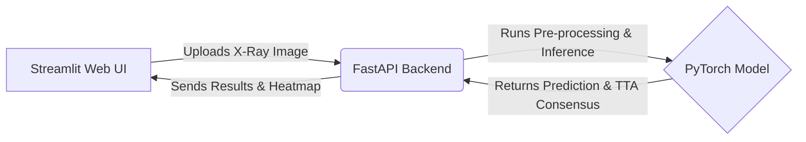

# 🫁 Chest X-Ray AI: Clinical Triage Optimization

[](https://www.python.org/)
[](https://pytorch.org/)
[](https://streamlit.io/)

> ⚠️ **STRICTLY FOR ACADEMIC & PORTFOLIO PURPOSES**
> This project is an academic exploration of ML optimization and is **not** an FDA-approved medical device. It must not be used for actual diagnosis or clinical decision-making.

> 🌐 **Live Interactive Demo:**
> **Note:** You may need to start the backend API and the frontend Streamlit app separately. 
> **Backend API:** [`https://huggingface.co/spaces/marcoscaballero27/pneumonia-triage-api`](https://huggingface.co/spaces/marcoscaballero27/pneumonia-triage-api)
> **Frontend Streamlit app:** [`https://huggingface.co/spaces/marcoscaballero27/pneumonia-triage-ui`](https://huggingface.co/spaces/marcoscaballero27/pneumonia-triage-ui)  

---

## 📌 Executive Summary

This project builds an end-to-end Machine Learning classification model for detecting Pneumonia in Chest X-Rays. 

While many tutorials focus purely on maximizing overall **Accuracy**, this project takes a **strictly clinical product approach.** In a medical triage setting, the cost of errors is highly asymmetric:
* 💸 **False Positive (FP):** Diagnosing pneumonia in a healthy patient causes temporary anxiety and costs resources (extra tests).
* ⚠️ **False Negative (FN):** Sending a sick patient home undiagnosed poses a severe, potentially fatal health risk.

**The Objective:** Systematically iterate through neural network architectures, loss functions, and inference techniques to push **Recall (Sensitivity)** as close to 100% as possible, actively prioritizing the elimination of False Negatives.

---

## 🏗️ System Architecture

The project is structured as a decoupled full-stack application, ensuring a clean separation of concerns between the user interface and the ML inference engine.



---

## 🧪 The Data Science Journey

The core value of this project lies in the rigorous experimentation process documented in the [Training Logs](Documentation/Training_LOGS.md). Here is a summary of the path to zero False Negatives:

### 1. The Baseline & The Pitfalls of Class Weights
- **Starting Point (ResNet18):** Transfer learning achieved ~96% accuracy rapidly but left **19 False Negatives**, which is clinically unacceptable.
- **Mathematical Class Balancing:** Applying heavy penalties to the majority class (Normal) forced the model to be overly conservative. Mathematical balance does not equal clinical safety. 
- After that, we tried applying higher weigths to pneumonia class sligthly improved false positives while maintaining the same number of false negatives. 

### 2. Pushing Limits with Focal Loss & Threshold Tuning
- **Focal Loss:** Replaced standard `CrossEntropyLoss` with Focal Loss to force the network to pay attention to "hard" clinical examples.
- **Threshold Tuning:** Shifted the probabilistic decision boundary from a default 50% to 20-30%. This decision proved that separating mathematical training from clinical decision-making during inference is a far superior, stable strategy.

### 3. Solving Domain Shift with "The Gold Standard" (DenseNet121)
- **The Generalization Problem:** When the overly optimized ResNet faced external, heterogeneous data from different hospital machines (Domain Shift), overall accuracy plummeted due to over-fitting.
- **The Solution:** Our project pivoted to **DenseNet121**, establishing it as the *gold standard* architecture. By applying **Deep Fine-Tuning** (unfreezing deep layers), testing aggressive data augmentation to simulate different scanner calibrations, and doubling the input resolution to **448x448**, the neural network stabilized dramatically.

### 4. Consensus via Test-Time Augmentation (TTA)
- To aggressively filter out the most stubborn errors without entirely destroying specificity, we utilized 3-way geometric consensus (Original image, Rotated, Zoomed) during the live inference phase.

---

## 🏆 Final Model & Results

The final production candidate is a **Fine-Tuned DenseNet121 (448px)**.

### Metric Comparison (Baseline vs Final)

To highlight the impact of our clinical optimization, here is how the final architecture compares to the initial baseline model:

| Metric | Baseline (Initial ResNet18) | Final Model (Fine-Tuned DenseNet121) | Clinical Impact |
| :--- | :---: | :---: | :--- |
| **False Negatives (FN)** | 19 | **0** | 🎯 **Perfect Triage.** 19 sick patients saved from being sent home. |
| **False Positives (FP)** | 23 | 115 | ⚠️ Expected trade-off. Increased hospital load, but manageable. |
| **Recall (Sensitivity)** | ~97.5% | **100%** | The system catches every single case of Pneumonia. |

*(Note: The final model metrics reflect performance against a strict external **Domain Shift** test set, proving highly robust generalization).*

### 🔍 Explainability (XAI) & Grad-CAM

Deep learning models are often seen as "black boxes", which is unacceptable in healthcare. To solve this, our decoupled pipeline (`api/app.py` and `frontend/app.py`) natively implements **Grad-CAM (Gradient-weighted Class Activation Mapping)**. 

When a scan is processed, the UI displays a heat map over the original X-Ray. **The red zones indicate exactly where the AI is looking** to make its diagnosis. This empowers doctors to verify if the model is focusing on genuine pulmonary infiltrates (true pneumonia) or if it is being fooled by background noise or medical tubes.

> 💡 **Key Finding via XAI:** During our evaluation, Grad-CAM revealed evidence of **"Shortcut Learning" (the Clever Hans effect)** in some predictions, where the model anchored its decision on the patient's arms or shoulders rather than the lung parenchyma. Exposing this flaw was a critical success of the XAI implementation. As outlined in the V2 Roadmap, mitigating this through anatomical segmentation is the next major objective.

---

## 🗺️ V2 Future Roadmap

To move beyond the MVP and solve ML "Shortcut Learning" (where models look at the wrong features—often known as the Clever Hans effect), future iterations are planned to implement:
1. **Anatomical Segmentation (U-Net):** Masking out external medical tubes, arms, and text to force the classifier to focus purely on lung parenchyma.
2. **Attention Mechanisms (ViTs):** Enhancing the CNN with self-attention to dynamically focus on pathological patches.
3. **Algorithmic Out-of-Distribution (OOD):** Building a lightweight binary gatekeeping model to reject invalid uploads (e.g., non-X-ray images) before invoking the heavy triage protocol.

> **Note on Language:** While this README and the core analysis are in English, you may notice some underlying documentation and code comments (`Training_LOGS.es.md`, etc.) are in Spanish. The foundational experimentation steps were originally conceptualized and drafted in Spanish. They remain for legacy completeness but are non-relevant to the core application logic and final architecture.

---

## 💻 Local Installation & Usage

To run the full Streamlit UI and inference engine locally:

```bash
# 1. Clone the repository
git clone https://github.com/your-username/Chest_XRay_AI.git
cd Chest_XRay_AI

# 2. Create a virtual environment (Recommended)
python -m venv venv
# On Windows:
venv\Scripts\activate
# On macOS/Linux:
source venv/bin/activate

# 3. Install dependencies
pip install -r requirements.txt

# 4. Run the Streamlit Application (adjust the path if necessary)
streamlit run app.py
```
*(Ensure you have downloaded the required pre-trained weights into the `Weights/` directory as specified in the UI codebase prior to running the application).*
